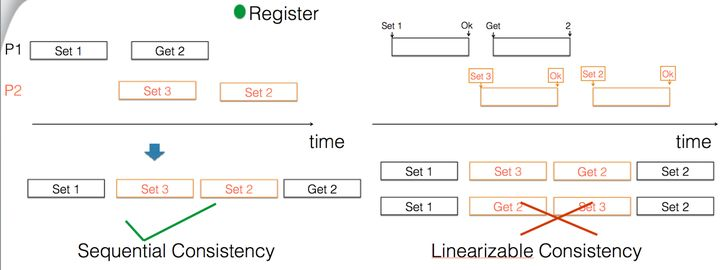

---

---

### 理论

##### 异步网络下

​	FLP--在假设网络可靠、计算节点只会因崩溃而失效的最小化异步模型系统中，仍然不存在一个可以解决一致性问题的确定性算法。在一个完全异步通讯的模型下，只要存在一个故障节点，就不存在一种确定的共识算法。

A Note on Distributed Computing

[博客重点解释](https://blog.csdn.net/u013354486/article/details/103935264)

> 本地程序调用运行与分布式程序调用运行，有些区别是需要注意的地方。

---

## 一致性问题算法

### -  2PC（两阶段提交） &   3PC（三阶段提交，避免2PC中的阻塞问题）  --  数据库理论方面

> **[Two Phase Commit](https://link.zhihu.com/?target=https%3A//www.microsoft.com/en-us/research/wp-content/uploads/2016/05/ccontrol.zip)(Lampson 1976/Jim Gary 1979)    2PC**
>
> **[“NonBlocking Commit Protocols” (Dale Skeen 1981)](https://link.zhihu.com/?target=http%3A//www.cs.cornell.edu/courses/cs614/2004sp/papers/Ske81.pdf)    3PC**

​	2PC作为一个一致性算法，用来保证所有的进程在“事务要么提交要么失败退出”上达成一致。2PC是安全的，不会有坏的数据被写入到数据库，但是它的活性并不好：如果事务管理器在一个错误的点上失败，那么系统会阻塞。

​	3PC作为2PC的改进版，增加了对参与者的超时机制。这就使协调者和参与者都有了超时机制，避免2PC中的阻塞问题。

### -  Paxos 共识算法

前提：没有出现恶意节点（即拜占庭将军问题）。传统分布式领域不需要担心机器会故意发送错误信息。


### -  顺序一致性 ( Sequential Conistency )  VS  线性一致性 ( Linearizability )（也叫原子性）



从强弱一致性来讲，线性一致性  >  顺序一致性；***线性一致性一定是顺序一致性，但是顺序一致性不一定是线性一致性***；

- 顺序一致性：每个机器上执行程序的顺序相同，不关心与原本程序描述的正确顺序是否一致。**不要求与全局时钟保持一致**。

  顺序一致需要每个线程中的程序运行的相对顺序一致，但不要求不同线程之间的程序运行的绝对顺序一致(1)。但是**必须满足Get操作的得到的必须是最近一次Set的值才可以，在满足这个条件之后，才可以要求(1);**

  如上图Sequential Consistency所示：***横线上方作为全局时钟所要求的程序运行顺序*。**

- 线性一致性：每个机器上执行程序的顺序相同，并且与原本程序描述的正确顺序一致。**需要与全局时钟下的顺序保持一致**。

  线性一致需要每个线程中的程序运行的相对顺序一致，并且要求不同线程之间的程序运行的绝对顺序一致；

```
参考文章：https://zhuanlan.zhihu.com/p/338057286
```


---

### -  FLP结论

***结论前提：***

1、假设处理过程是完全异步的，也就是说对于进程的处理速率以及消息传输延时没有任何假设。

2、假设进程无法访问同步时钟，因此就不能使用那些依赖于超时的算法。

***结论：***不存在一个完全正确的异步一致性协议，即使是只有一个进程突发性地死掉。