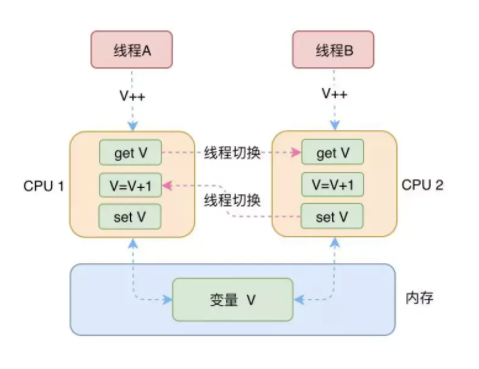
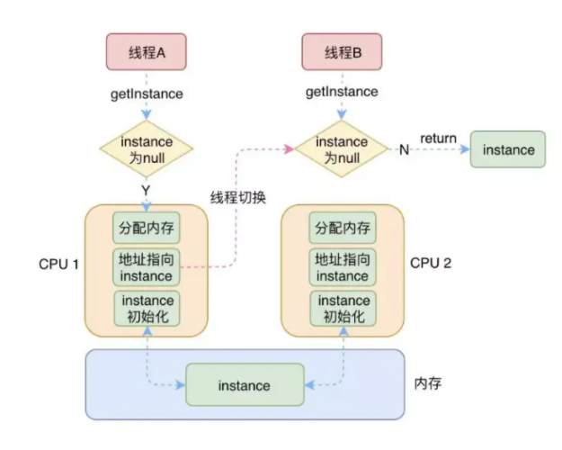
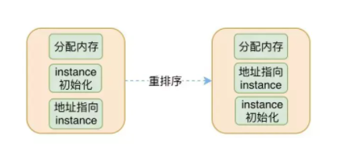

## 并发问题

#### 根源

1. ##### 可见性：一个线程对共享变量改变，另一个线程是否可见

   <1> 在单CPU场景下，不会出现类似的并发问题。因为单CPU中变量值改变不会影响不同线程的资源共享。

   _单CPU.PNG)

   <2> 但是现在的CPU都是多核的，程序会在多个CPU中运行。这样会导致脏数据的产生。（线程A 在CPU1 中对变量 V 设置了一个新的值，但是线程B是在 CPU2 中，而 CPU1 对缓存进行了修改，并不会通知到 CPU2，所以这时线程B 拿到的变量 V 的值还是原来的老的值，也就是脏数据。

   _多核CPU.PNG)

2. ##### 原子性：一个或者多个操作在CPU执行的过程中是否会被中断。CPU线程切换问题。

   什么是原子性：把一个或者多个操作视为一个整体，在执行操作的过程中不能被打断的特性。

   执行了一半的操作，CPU 到别的地方转了一圈回来之后，你原本的操作结果很可能就不对了，为什么会不对呢，因为你在等待 CPU 的这段时间内，很可能有别的线程也执行了和你相同的事。

   

   

3. ##### 有序性：程序编译后的指令是否会按照代码原来的顺序执行

   编译器或者运行时环境为了优化程序性能，通常会对指令进行重新排序。一般重排序分为：**编译器重排序**和**运行期排序**。

   一般来说，我们是无法预知不同的线程之间的指令是如何运行的。

   在**java**中，java为了提升程序的性能，往往会对程序的指令进行重排序，这就会导致有些不太好的程序面临出现并发问题的情况。

   对于**程序**来说，如果按照我们写的程序顺序执行，那自然是没有什么问题的。但是如果重排序之后就不一定能保证没有问题。

   

   **上图**是将cpu中创建单例对象的指令顺序进行了调换，导致最后会出现空指针错误。

   **指令顺序的调换：**

   

   原本按照原来的顺序执行，会正常生成一个单例对象。但是指令重排序之后导致出错。